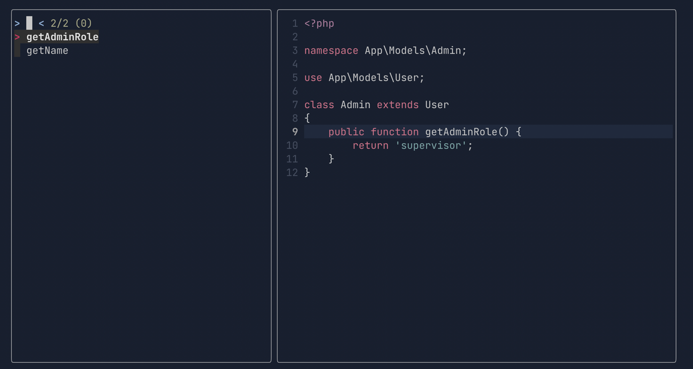

# Document Symbols Improved

A simple neovim plugin to display document symbols with inherited members.

# Problem
The current [LSP document symbols](https://microsoft.github.io/language-server-protocol/specifications/lsp/3.17/specification/#textDocument_documentSymbol) does not consider inherted members. which is something I used to have with [PHPStorm](https://www.jetbrains.com/phpstorm/promo/?source=ahmedash95.github.io) and had saved me alot navigating the code. and as I'm moving to Neovim. I missed that feature and after some looking and searching I could not find any good replacement. so I decided to make it myself. 

the project scope should and always will be small. focusing only on PHP as it's my primary language. and would just change to serve future versions of PHP. 


## Prerequisites
- Neovim
- [FZFLua](https://github.com/ibhagwan/fzf-lua)
- PHP
- Composer

## Preview
Let's say in your project you have 2 models Admin.php and User.php
```php
class User
{
    public function getName() {
        return 'John';
    }
}

class Admin extends User
{
    public function getAdminRole() {
        return 'supervisor';
    }
}
```
What this plugin, it would show you all the members and inherited members of the class you are currently in.



### Install

TBD.

### Usage

TBD.
